# Trainning Vietnix first task    

  

##    1. Xem dung lượng đĩa:  
###     1.1 df -ha  
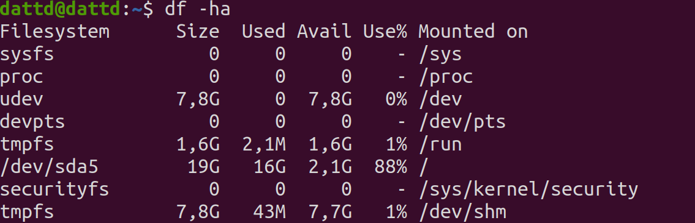  

##    2.  Xem các phân vùng trong hệ thống:  
###     2.1 fdisk -l  
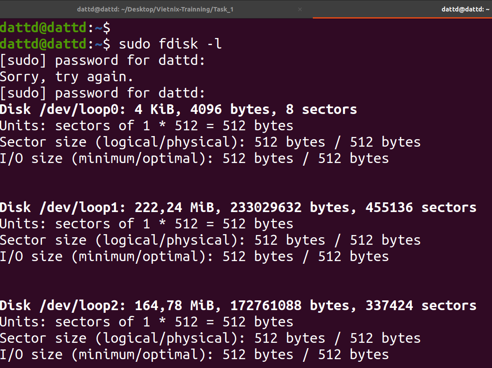  

###     2.2 lsblk  
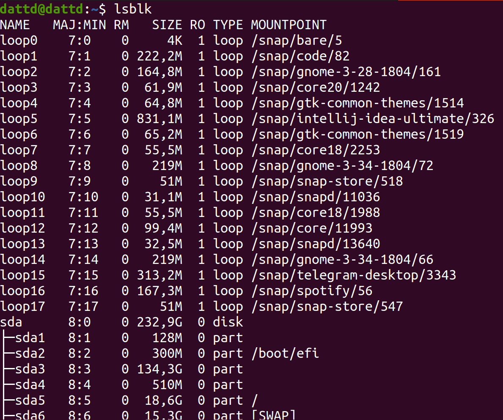  

##    3.  Xem cpu, ram, network:  
###     3.1 CPU:  
            
    
  * - Xem thông tin của CPU: cat file /proc/cpuinfo  
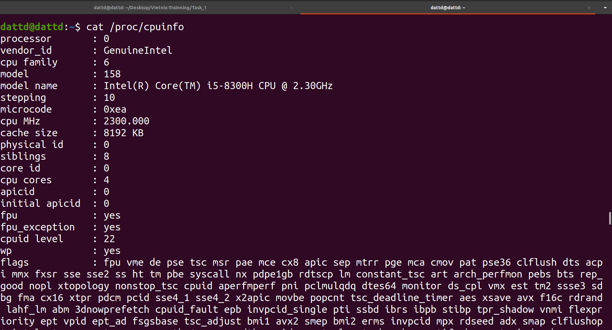   
            

  * - Xem kiến trúc của CPU: lscpu  
  
###     3.2 RAM: sẽ sử dụng lệnh free kèm theo các tham số 
  * - Tham số -h sẽ cho ra kết quả dễ xem: free -h  
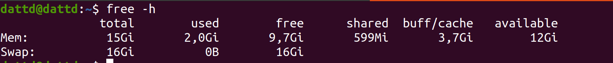  

###     3.3 Network: sử dụng lệnh netstat để xem các kết nối mạng (có thể xem các kết nối tcp hoặc udp tùy theo tham số)  

  * - netstat -lp: Xem tất cả các port đang lắng nghe hoặc kết nối (bao gồm tcp và udp), có thể xem được PID của từng process thuận tiện cho việc monitor  
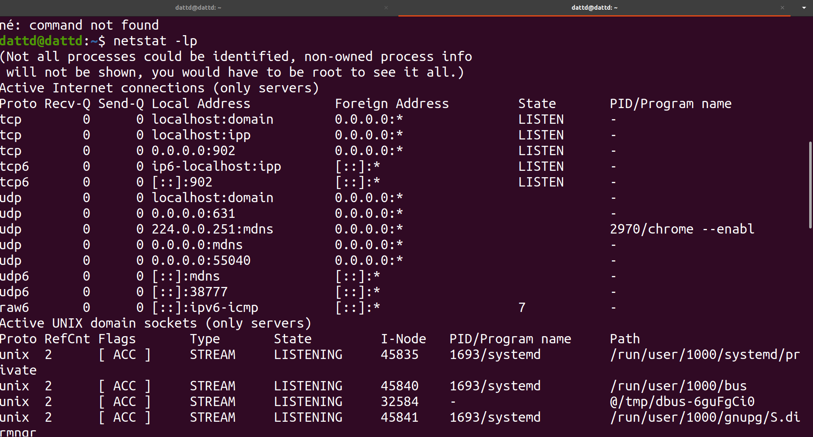  

##  4. Theo dõi chi tiết các tiến trình  
- top: được sử dụng để theo dõi các tiến trình đang chạy(thời gian chạy, tổng số tiến trình đang chạy, tài nguyên được sử dụng, vd: RAM, CPU, Swap, lệnh để chạy, PID, ....)    
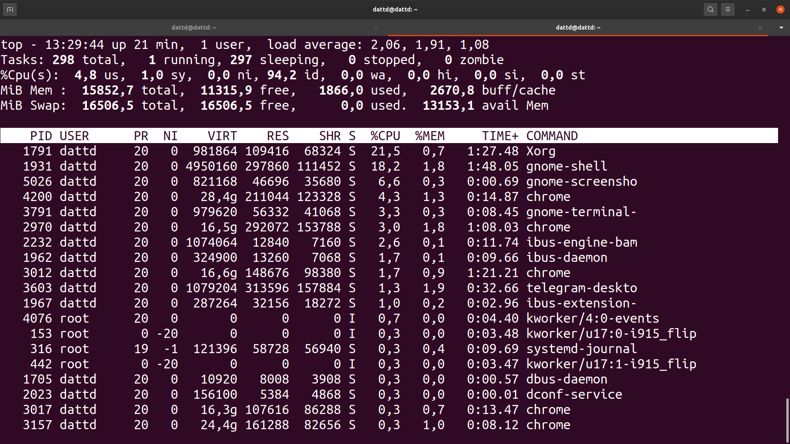  

- Các thông tin liên quan đến CPU:  

- Các thông tin lien quan đến RAM:  
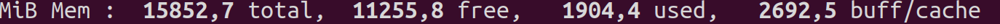  
- Các thông tin liên quan đến phân vùng swap(phân vùng được sử dụng RAM hết)  
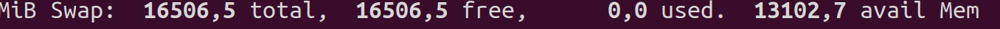  
- Ngoài ra có thể sử dụng htop (cho phép hiển thị trực quan hơn, có thể thao tác bằng chuột, việc kill 1 process có thể được thực hiện dễ dàng mà không cần biết PID):  
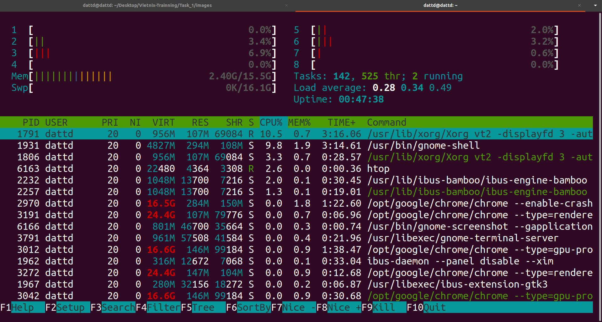  

-  kill: có thể sử dụng để tắt 1 tiến trình cụ thể, vd: kill -9 [PID] sẽ force kill tiến trình có PID cụ thể  
## 5. Liệt kê danh sách file, thư mục
- ls: Được sử dụng để liệt kê các file hoăc folder cụ thể, lệnh này cũng có thể được sử dụng kèm theo các tham số để xem được nhiều thông tin như: các permission, người sở hữu, ngày tạo file, ...  
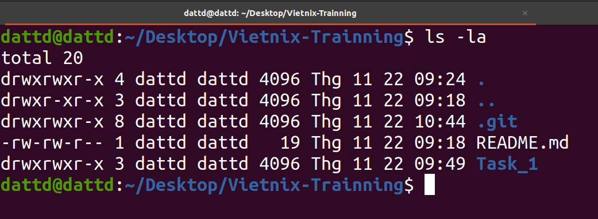  

-tree: có thể được sử dụng đê liệt kê các file và thư mục theo dạng cây  
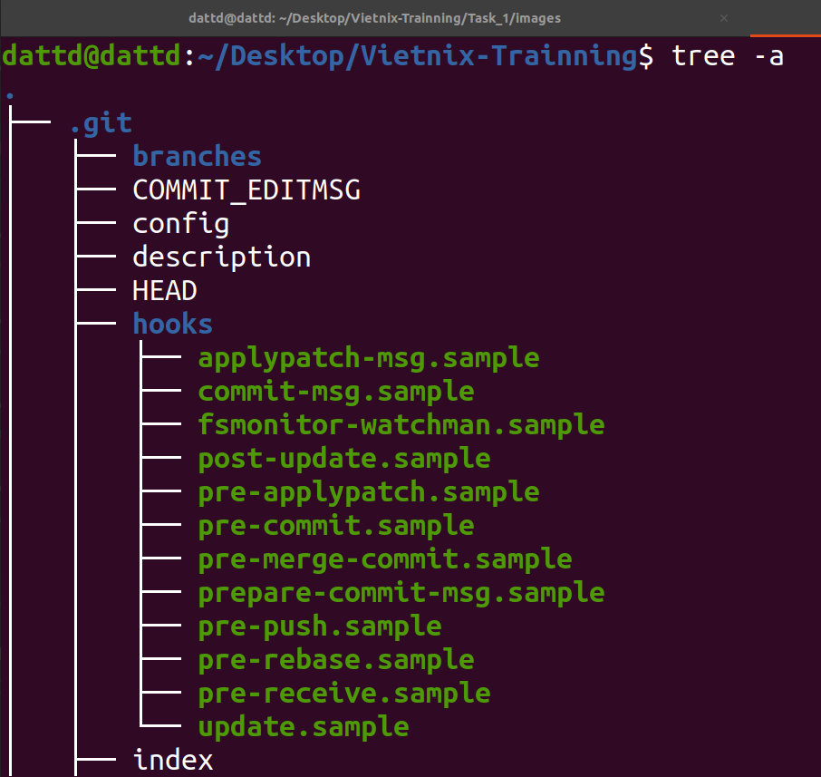

## 6. Tìm kiếm, copy, di chuyển,... file/thư mục
###     6.1 Tìm kiếm file/thư mục:  
- find:  có thể tìm kiêms theo tên tuyệt đối hoặc tương đối  
- Tìm kiếm tuyệt đối: find -name [filename]  
  
- Tìm kiếm tương đối:  find -name filename* (tìm trong hệ thông tất cả các file bắt đầu bằng filname)   
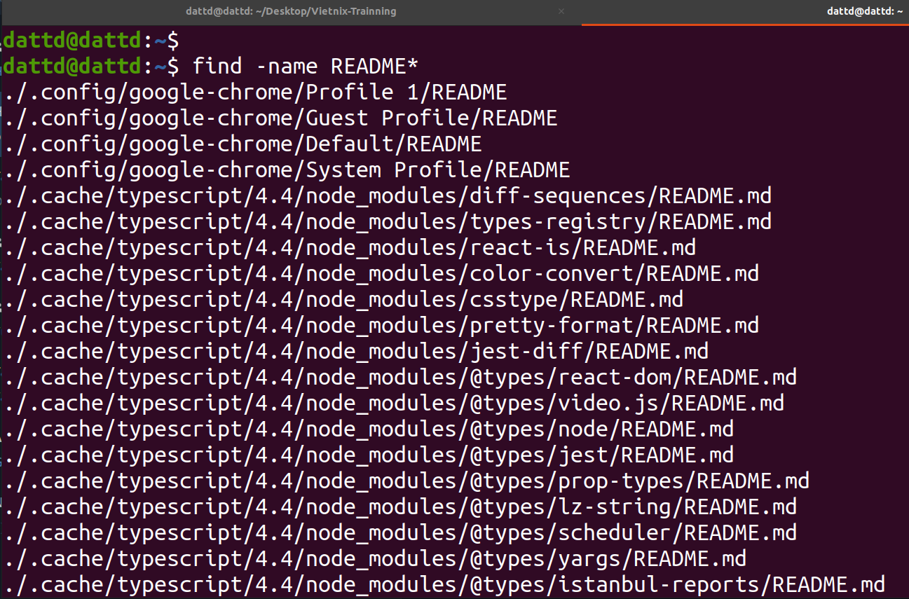  

###     6.2 Copy file hoăc folder: cp  
- cp [file_path] [copy_to_path]  
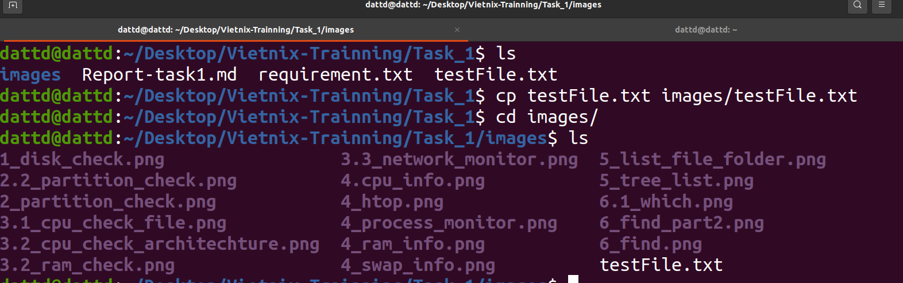
###     6.3 Di chuyển file hoặc folder: mv  
  * mv [old_path] [new_path]  
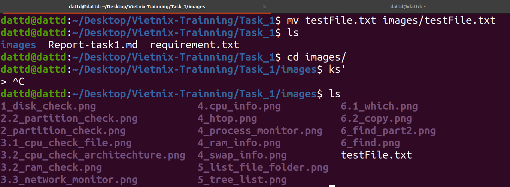  
- Lưu ý: lệnh mv cũng có thể dung để đổi tên 1 file hoặc 1 folder  
## 7. Phân quyền  
- Sử dụng lệnh chmod kèm theo các tham số để thực hiện phân quyền  
- Các quyền về file trong Linux:  
        + x: quyền thực thi(đối với các file runable)  
        + r: quyền đọc file  
        + w: quyền ghi/ sửa đổi file  
- Ngoài các quyền được ký hiệu bằng chũ như x,w,r thì Linux cũng đinh nghĩa các quyền của 1 file theo những số:  
        + 1:  thực thi  
        + 2:  ghi  
        + 4:  đọc  
        + 7 = 4 + 2 + 1: tất cả mọi quyền  
- Các quyền về người dùng: Linux phân chia người dùng thành 3 nhóm và ta có thể thay đổi quyền quyền thực của file theo từng nhóm:  
        + user  
        + group  
        + other  
- Sử dụng lệnh chown đẻ thay đổi quyền sở hữu file của user: chown [new_owner] [filename]  
- Sử dụng lệnh chrgrp đẻ thay đổi quyền sở hữu file của group: chown [new_group_owner] [filename]  

## 8. Các trình editor: vim, vi, gedit...   
###     8.1 Vi  
- Để sử dụng trình soạn thảo vi ta dùng lênh: vi [filename]  
- Sau khi vào trình soạn thảo, vi cung cấp cho chúng ta các chế độ:   
        + command: chỉ có thể đọc  
        + insert:  chỉnh sửa văn bản
        + quit: thoát khỏi trình soạn thảo  
        + save: lưu lại nếu có sự thay đổi  
- Khi mới mở vi lên thì mặc định sẽ ở chế độ command, để có thể sửa đỏi văn bản ta phải chuyển sang chế độ insert bằng cách ấn phím i  
- Khi ở chế độ insert ta có thể chỉnh sửa văn bản
- Ta bấm esc sau đó :q để thoát khỏi vi  
- Nếu có bất kì sự thay đổi nào thì vi sẽ không cho chúng ta thoát bằng :q, chúng ta có thể thoát mà không lưu lại băng :q! hoặc lưu xong thoát bằng :wq  
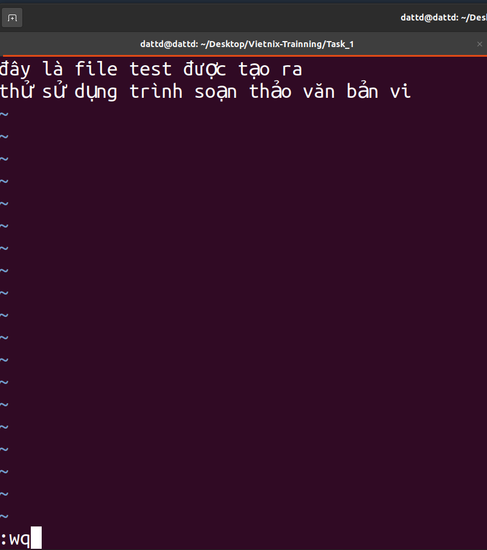  

- Ngoài chỉnh sủa tài liệu ở mức cơ bản, vi cũng cung cấp cho chúng ta nhiều tiện ích như copy(yy), dán(P), chèn dòng mới(o), xóa 1 dòng (cc), ...  
###        8.2 Gedit  
- Dễ sử dụng hơn vi bởi vì co giao diện đồ họa như notepad tên window  
- Để mở 1 văn bản bằng egdit ta sử dụng lệnh: gedit [file_name]  
- Những tao tác như copy, xóa, dán, tìm kiếm cũng dễ dàng thực hiện hơn so với việc sử dụng vi  
- Để sử dụng trình soạn thảo vi ta dùng lênh: vi [filename]  
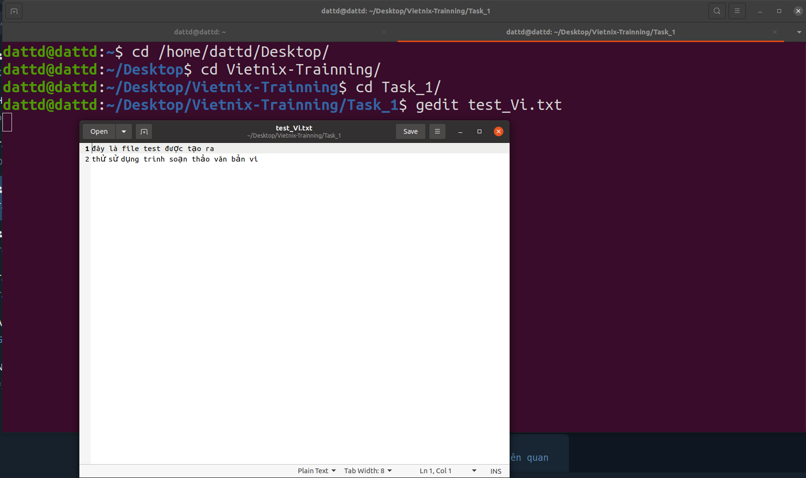  

## 9. Mount/ Unmount
###     9.1 Mount: 
- Lệnh mount được sử dụng kết nối các ổ dĩa vật lý vào file system của linux  
- Trước khi mount 1 ổ đĩa ta dùng lẹnh lsblk đẻ kiểm tra linux có nhậ được ổ cứng hay chưa  
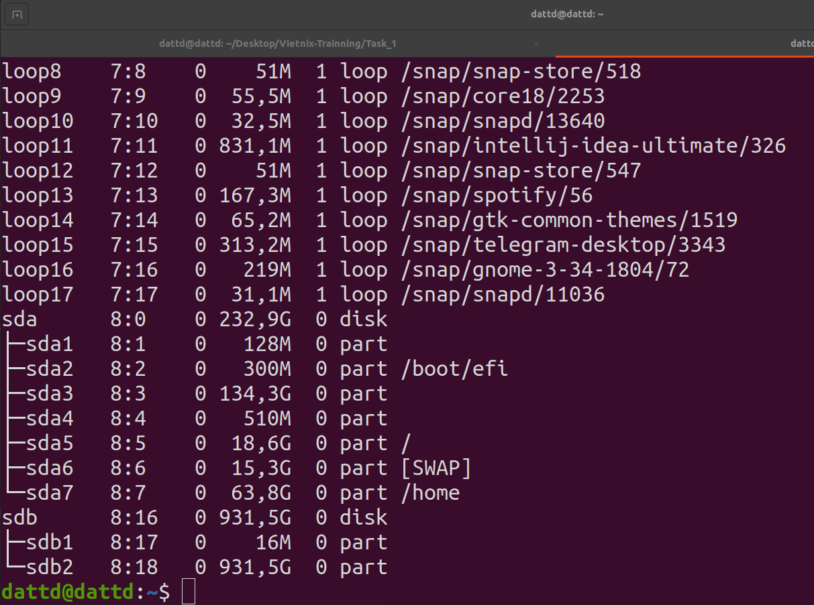  
- Linux đã nhận được hai 2 cứng (sda và sdb), ta sẽ thực hiện mount ổ sdb vào file system của linux  
- Cú pháp của lệnh mount: mount [device file] [mount point]  
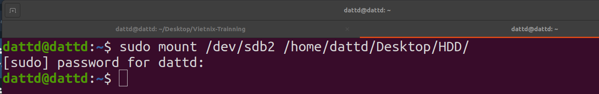  
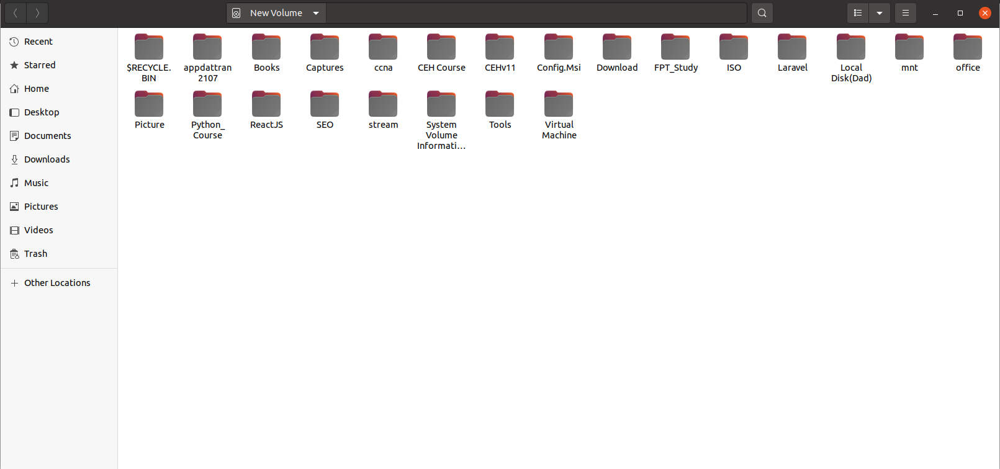  
- Khi mount thành công nhưng khởi động xong sẽ bị mất vì vậy ta thực hiện ghi vao file /etc/fstab để khi khởi động lại máy vẫn còn  
###     9.2 Umount:
- Ngược với mount để liê kết, umount để hủy bỏ liên kết từ Linux filesystem đến ổ cứng vật lý  
- Cú pháp: umount [device file]  
## 10. Symbolic Links  
- Symbolic links là một file đặc biệt trỏ đến một file hoặc thư mục khác - được gọi là target. Khi được tạo, một symbolic links có thể được sử dụng thay cho target file. Nó có thể có một tên độc nhất, và được đặt trong bất kỳ thư mục nào. Nhiều symbolic links thậm chí có thể được tạo cho cùng một target file, cho phép truy cập target bằng nhiều tên khác nhau.  
- Cú pháp: ln -s SOURCE_FILE SYMBOLIC_LINK 
## 11. Hard links  
- Hard links là các liên kết cấp thấp ( low-level links) mà hệ thống sử dụng để tạo các thành phần của chính hệ thống file, chẳng hạn như file và thư mục. Hard links sẽ tạo một liên kết trong cùng hệ thống tập tin với 2 inode entry tương ứng trỏ đến cùng một nội dung vật lý  
- Cú pháp: ln SOURCE_FILE SYMBOLIC_LINK  
## 12. Nén/ Giải nén  
- Nén và giải nén trên linux có thể sư dụng 2 công cụ chính là zip hoặc tar (tùy thuộc theo định dạng nén)  
###     12.1 Gzip  
             + Nén: gzip [filename.zpi]  
             + Giải nén: gzip -d [filename.zip]  
###     12.2 Tar
              + Nén: tar -cvzf  
              + Giải nén: tar -xvzf  
## 13. Đo lương băng thông sử dụng:  
  * bmon:   
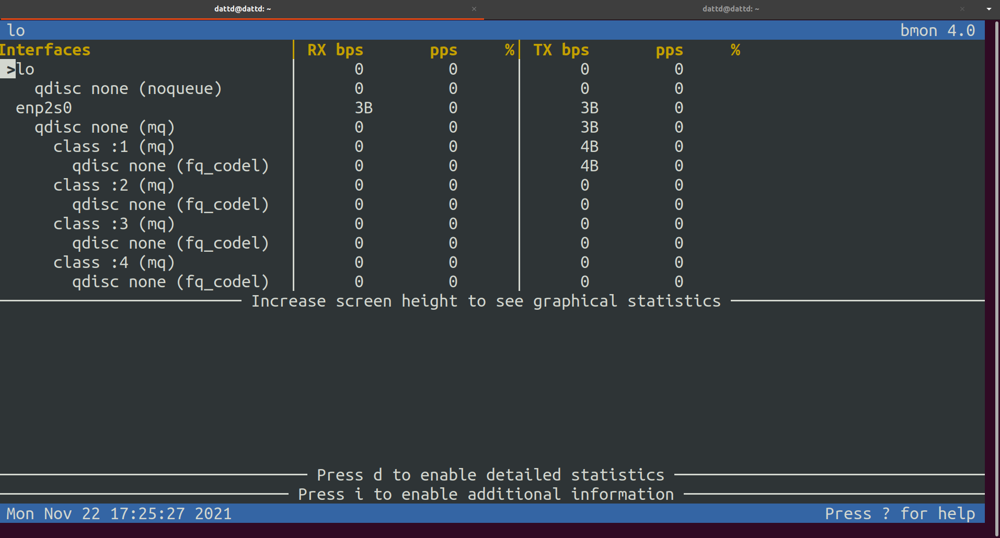  
  * vnstat:  
  * Vào file /etc/vnstat.conf để cấu hình card mạng trước khi sử dụng  
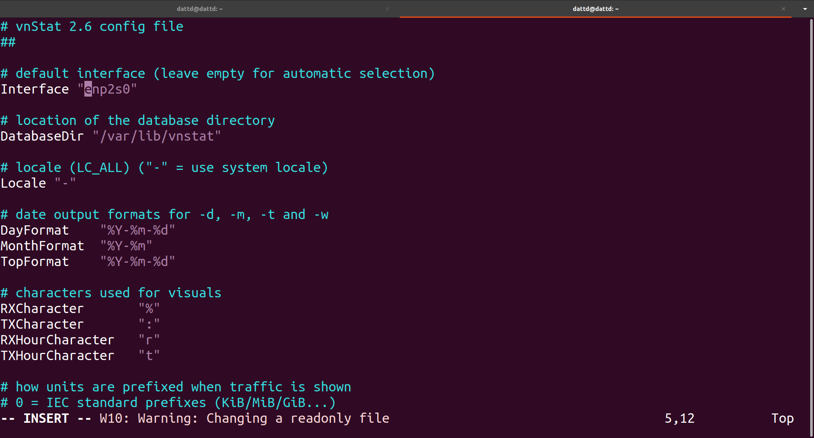  
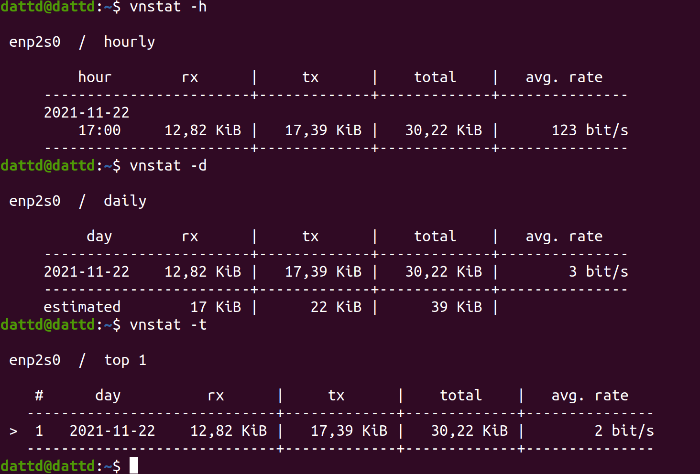  
## 14. nmap, telnet, ping, ssh, transfer files from local to public host (máy ảo thay thế có ip local: 192.168.1.131)  
### 14.1    nmap: nmap là công dụng dùng để scan các remote host để thu thập được các thông tin như: port đang lắng nghe, phiên bản OS, phần mềm, .....  
-   Cú pháp chung: nmap [option] [target IP]  
-   Các option hay đươc sư dụng trên nmap:  
            + sA: TCP Ack Scan để scan các chế độ của firewall (statefull hay stateless), filter những port nào, ...  
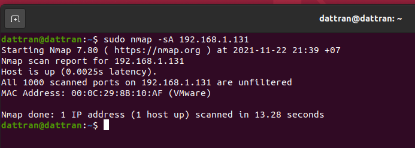  
            + A: scan agressive => dễ bị phát hiện  
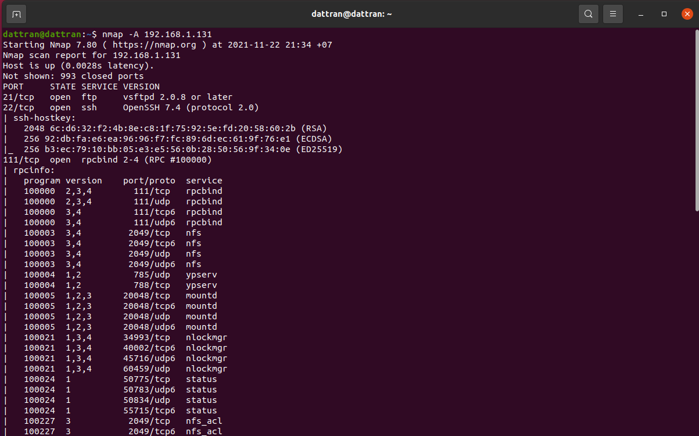  
            + sP: scan những server nào đang hoạt động  
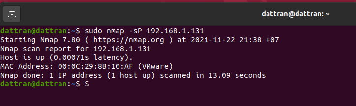  
            + sV: scan các phien bản của những phần mềm được sử dụng ở máy target  
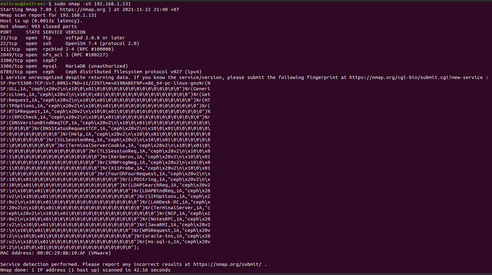  

### 14.2    telnet: là implementation của giao thức telnet, dùng để kết nối remote vào máy khác  
- Cú pháp: telnet [IP's target] [port's target]  
- 
  

### 14.3     ssh: là implementation của giao thức ssh và là phiên bản nâng cấp của telnet dùng để kết nối remote đến máy khác một cách bảo mật  
- Cú pháp: ssh usename@ip_target  
- 
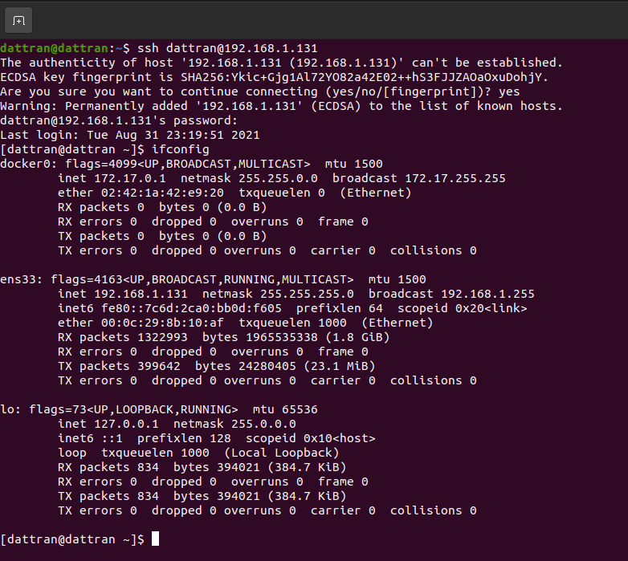  

### 14.4 ping: dựa tren trên giao thức ICMP để kiếm tra kết nôi giữa 2 thiết bị đầu cuối  
- Cú pháp: ping [ip's target]  
- 
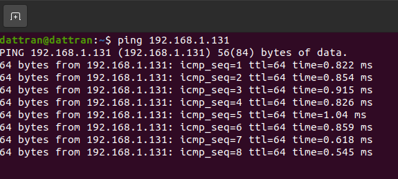   

### 14.5 scp: dựa trên giao thức ssh để implement việc truyền file giữa 2 máy tính 1 cách an toàn   

- Cú pháp: scp [option] [source] username@ip_target:destinaion    
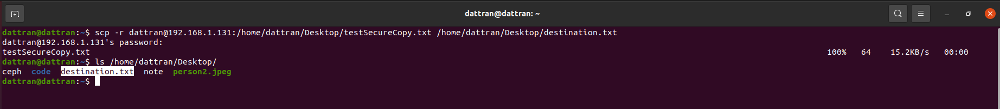   

## 15 Generate SSH Key:   
- ssh-keygen: là công cụ để sinh ra 1 cặp key cho SSH  
- Cú pháp: ssh-keygen để tạp cặp publi-priate key trên máy client  
- 
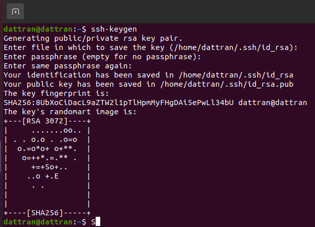  
- Gửi public key cho server:   
- Cú pháp: ssh-copy-id -i [file key public] user@ip-address  
- 
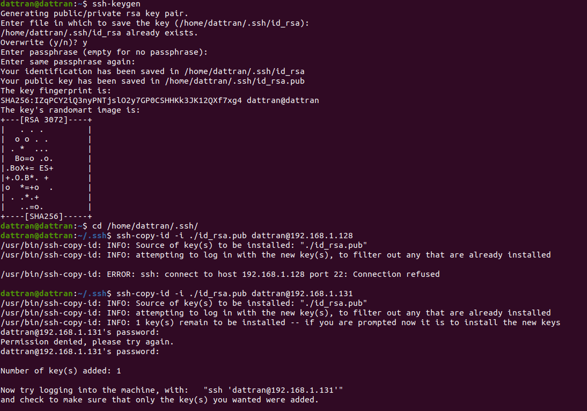  
- Kết nối ssh sử dụng ssh-keygen:  
- 
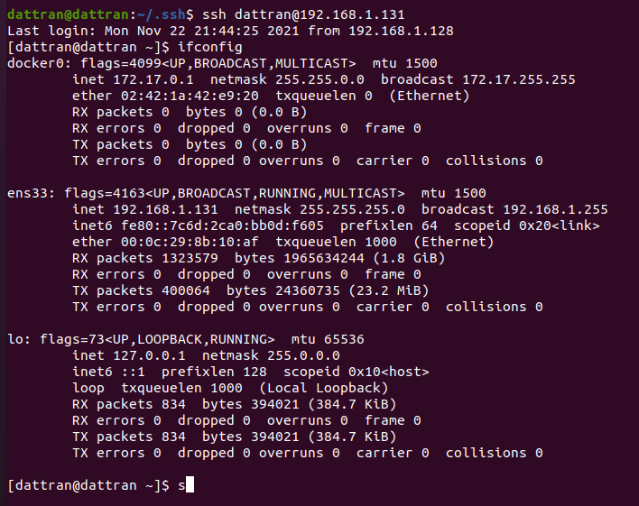  

## 16. Xem nội dung của file mà không cần sử dụng editor  
- cat: xem tất cả nội dung file  
- tail: xem những n dòng cuối của file(mặc định là 10)  
- head: xem những n dòng đầu cảu file(mặc định là 10)  
- less: mở một tệp để đọc tương tác, cho phép di chuyển lên xuống và tìm kiếm  
- more: dùng mở một tệp để đọc tương tác, cho phép di chuyển lên xuống và tìm kiếm  
- Lưu ý: Điểm khác biệt giữa less và more là less cho phép cuộn ngược lên các trang dữ liệu đã đọc, còn more thì chỉ có thể đọc từ đầu tới cuối. Lệnh less có thể dùng phím mũi tên trên bàn phím để scroll lên xuống, lệnh more không có chức năng này   
- Cú pháp:  
        + cat [filename]  
        + tail [filename]  
        + head [filename]  
        + less [filename]
        + more [filename]  

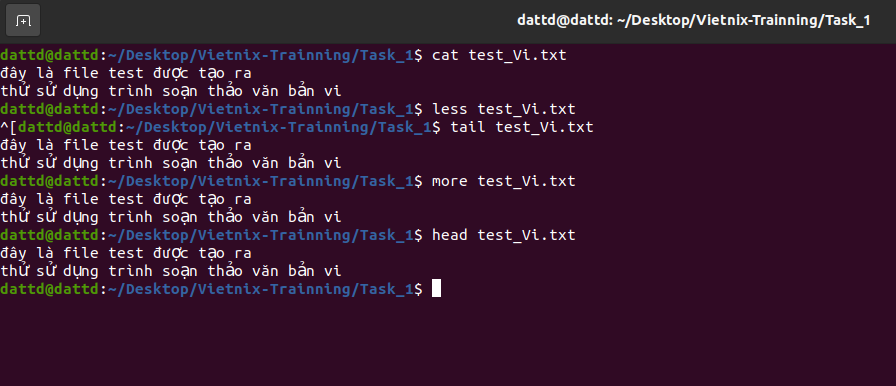  

## 17. Đổ nội dung 1 chuỗi vào cuối file  
- Sử dụn lênh ehco: echo "nội dung" >> [filename]  
       
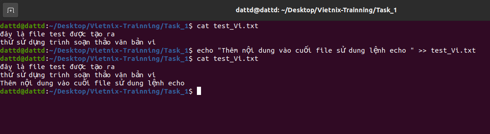  

## 18. Những lệnh cơ bản trên Linux  

###     18.1 grep: sử dụng như 1 pipeline để tìm kiếm  
            - Cú pháp: grep [option] [regex-pattern] [filename]  
            - 
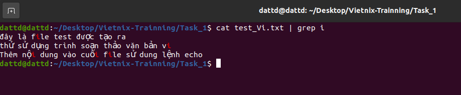       

###     18.2 awk: là một ngôn ngữ lập trình thông dịch, được thiết kế đặc biệt để xử lý văn bản  
- Cú pháp: awk [POSIX or GNU style options] -f progfile [--] file ...  

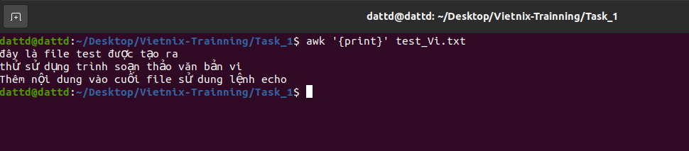  

###     18.3 sed: là một trình biên soạn văn bản thực hiện những thao tác chỉnh sửa đối với dữ liệu đến từ một đầu vào chuẩn hoặc một file text  
- Cú pháp cơ bản của lệnh sed: sed [option] commands [file-to-edit]  

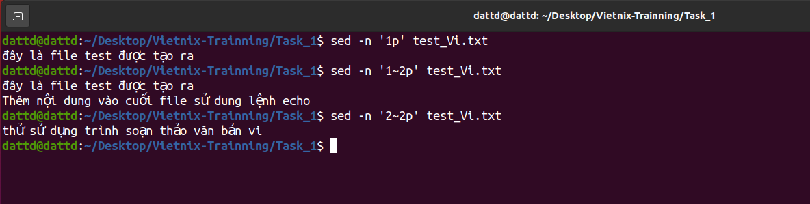  

###     18.4 tr: là một tiện ích được sử dụng để dịch, xóa các ký tự  
-  Cú pháp cơ bản của lệnh tr:  tr [option] [set1] [set2]  , trong đó  
        + set1: Liệt kê các ký tự trong văn bản phải được thay thế hoặc loại bỏ  
        + set2: Liệt kê các ký tự sẽ được thay thế cho các ký tự liệt kê trong set1   
- Thay thế những chữ abcdefgihjk từ thường sang hoa:

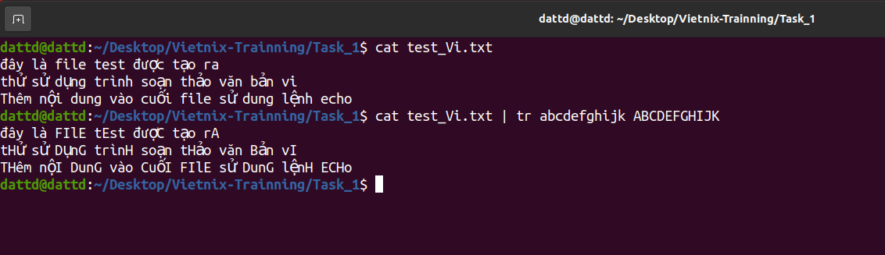  

###     18.5 sort: được sử dụng để sắp xếp các dòng của tệp văn bản  
- Cú pháp của lện sort:  sort [option] [file]  
- Option -r đê sắp xép theo thứ tự ngược lại  

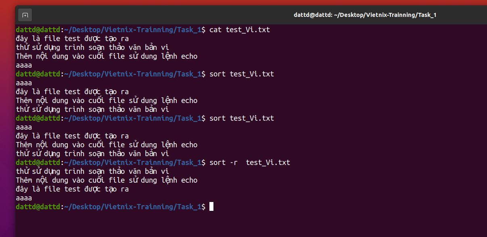  

###     18.6 uniq: dùng để bỏ các dòng liên tiếp trùng lặp trong một tệp văn bản   
- Cú pháp cơ bản của lệnh uniq: uniq [filename]  
- Lưu ý: Lệnh uniq yêu cầu các dòng trùng lặp phải liên tiếp, nên chúng ta thường chạy sắp xếp trước, sau đó mới chuyển đầu ra thành uniq  

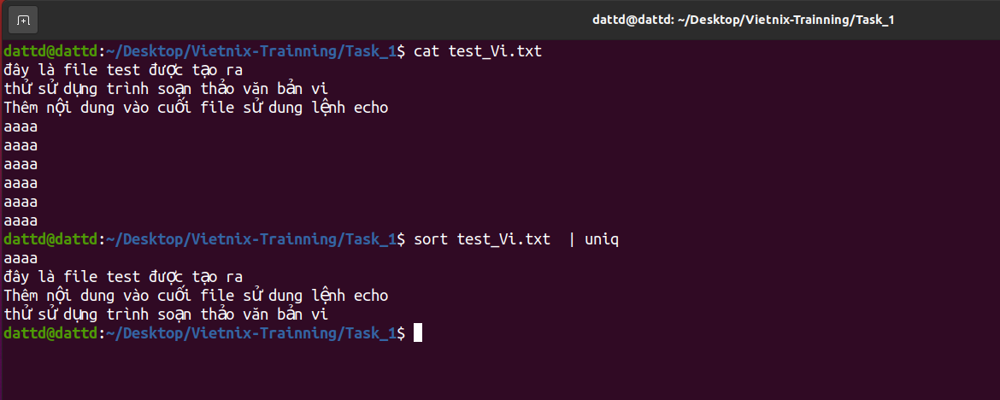    

###     18.7 cut: được sử dụng thao tác với tệp dựa trên cột và được thiết kế để trích xuất các cột cụ thể
- Cú pháp cơ bản của lệnh cut: cut [option] [filename]  
- Cắt trong fle từ cột 1-16  
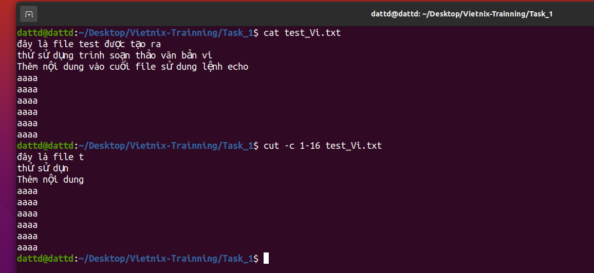  

###     18.8 join: Để thực hiện việc phép nối giữa các file  
- Cú pháp cơ bản của lệnh join: join [file1] [file2]  
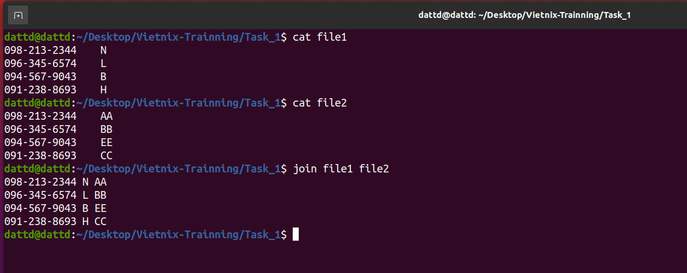  

###     18.9 diff: so sánh các file theo dòng  
- Cú pháp cơ bản của lệnh diff: diff [file1] [file2]   
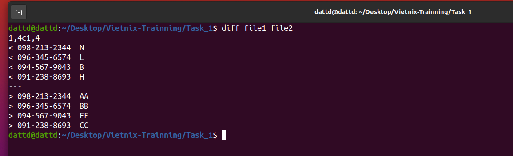  

###     18.10 xargs: là lệnh  được sử dụng để build và execute các lệnh từ đầu vào tiêu chuẩn   
- Cú pháp cơ bản của lệnh xargs:  xargs [options] [command [initial-arguments]]
- Các option của lệnh xargs:  
            -0 : input items are terminated by null character instead of white spaces  
            -a file : read items from file instead of standard input  
            –delimiter = delim : input items are terminated by a special character  
            -E eof-str : set the end of file string to eof-str  
            -I replace-str : replace occurrences of replace-str in the initial arguments with names read from standard input  
            -L max-lines : use at-most max-lines non-blank input lines per command line.  
            -p : prompt the user about whether to run each command line and read a line from terminal.  
            -r : If the standard input does not contain any nonblanks, do not run the command  
            -x : exit if the size is exceeded.  
            –help : print the summary of options to xargs and exit  
            –version : print the version no. of xargs and exit  

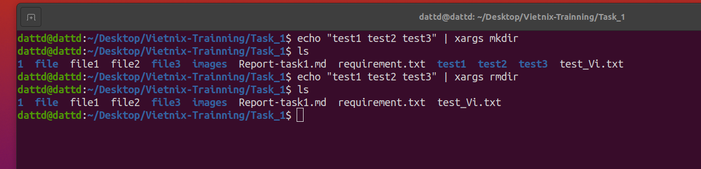   

### 18.11 traceroute: dùng để xác định số hop từ địa chỉ ngùôn đên địch  
- Cú pháp: traceroute [ip đích]   
- 
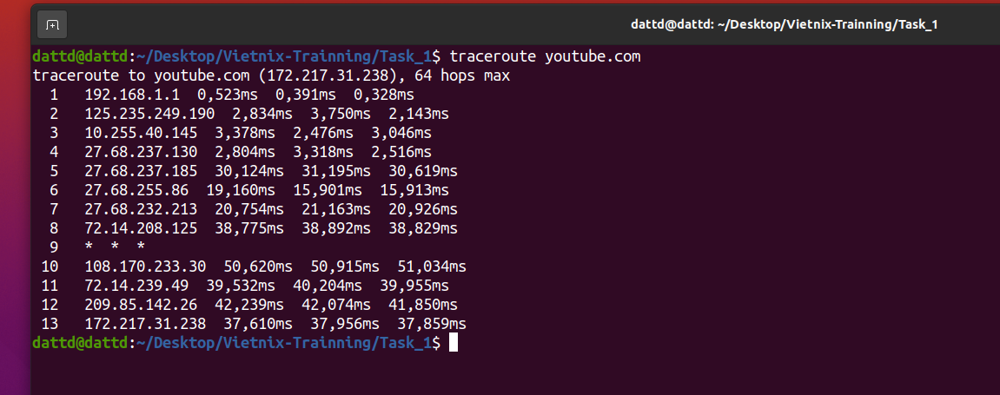  

### 18.12 pkill: Pkill cũng là lệnh kill nhưng được dùng để kill process bằng tên  
- Cú pháp cơ bản của lệnh pkill: pkill [option] [process name]

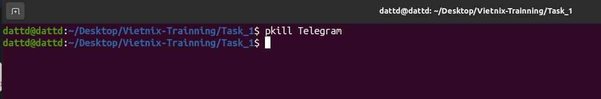  

### 18.13 wc: dược sử dụng để tìm kiếm thông tin về số lượng dòng, số lượng từ, byte hoặc số lượng kí tự của 1 file hoặc 1 biến có nội dung  
- Cú pháp cơ bản của lệnh wc:  wc [options] filenames  
- Các option của lệnh wc:  
        + -l: prints số dòng trong một file. 
        
        + -w: prints số từ trong một file. 
        
        + -c: hiển thị số bytes trong một file. 
        
        + -m: prints số kí tự trong một file. 

        + -L: prints độ dài của dòng dài nhất trong một file.

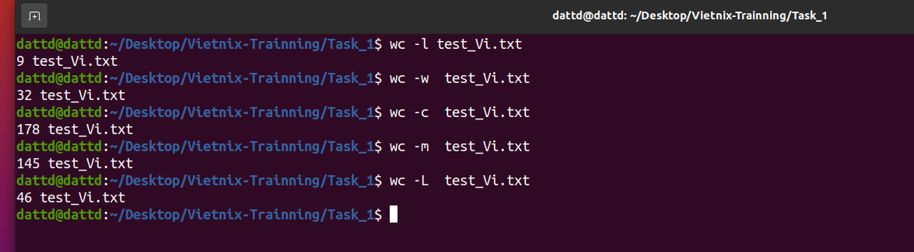  

###     18.14 wget: wget cho phép tải thông qua FTP, SFTP, HTTP, và HTTPS  
- Cú pháp cơ bản của lệnh wget:   wget [URL]  
- Các option của lệnh wget:  
        -o: is used to direct all the messages generated by the system.      
        -a: is used to append the output messages to the current output log file without overwriting the file.   
        -i: is used to read URLs from file.   
        -c: is used to resume a partially downloaded file.  
  

###     18.15 git: Git là một Hệ thống Kiểm soát Phiên bản (VCS)    
- Cú pháp cơ bản của lệnh git:  git [command] [params]  
- Các command cơ bản của lệnh git:  
        + add: Add file contents to the index
        + checkout: Switch branches or restore working tree files
        + clone: Clone a repository into a new directory
        + commit: Record changes to the repository
        + pull: Fetch from and integrate with another repository or a local branch
        + push: Update remote refs along with associated objects

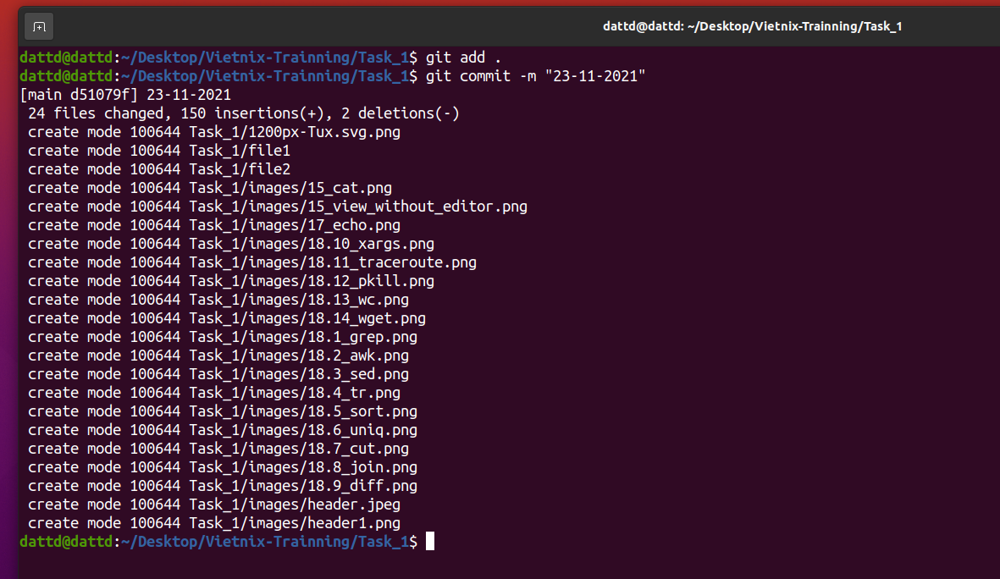  

###     18.16 rsync: là một công cụ hữu hiệu để sao lưu và đồng bộ dữ liệu trên Linux   
- Cú pháp cơ bản của lệnh git: rsync [options] [source] [destination]  
- Các command cơ bản của lệnh git:  
            -v : verbose   
            -r : sao chép dữ liệu theo cách đệ quy ( không bảo tồn mốc thời gian và permission trong quá trình truyền dữ liệu)  
            -a :chế độ lưu trữ cho phép sao chép các tệp đệ quy và giữ các liên kết, quyền sở hữu, nhóm và mốc thời gian  
            -z : nén dữ liệu  
            -h : định dạng số  

###     18.17 tee: chủ yếu được sử dụng kết hợp với các lệnh khác thông qua pipeline  
- Cú pháp cơ bản của lệnh tee: tee [OPTION]... [FILE]...  

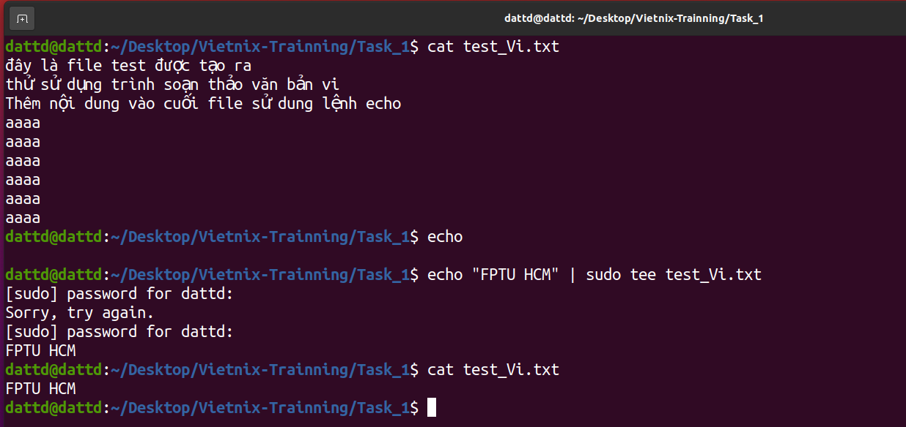  

###     18.18 mkdir: dùng để tạo thư mục thong file system  
- Cú pháp cơ bản của lệnh mkdir: mkdir [option] [filename]  

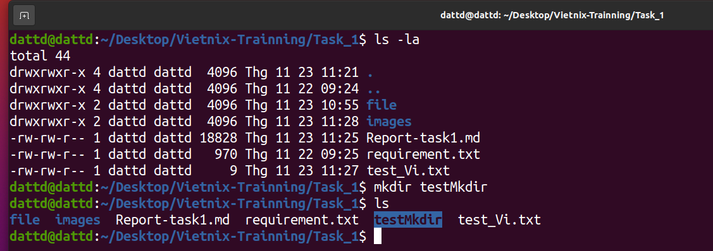  

## 19. Hiểu về Standard Input, Output, Error  
- Khi một lệnh bắt đầu chạy, nó thường mong đợi rằng các tệp sau đã được mở: Standard Input, Standard Output và Standard Error  
- Khi  nhập một lệnh, nếu không có tên tệp nào được cung cấp, thì bàn phím của bạn là đầu vào chuẩn, đôi khi được ký hiệu là stdin. Khi một lệnh kết thúc, kết quả sẽ được hiển thị trên màn hình  
- Màn hình  là Standard Output, đôi khi được biểu thị là stdout. Theo mặc định, các lệnh lấy đầu vào Standard Input và gửi kết quả Standard Output  
- Thông báo lỗi được chuyển hướng đến Standard Error, đôi khi được biểu thị là stderr. Theo mặc định, đây là màn hình của bạn.  

## 20. Redirecting Standard Input, Standard Output, Standard Error   
- Khi ký hiệu > tên tệp được thêm vào cuối một lệnh, đầu ra của lệnh sẽ được ghi vào tên tệp đã chỉ định. Biểu tượng > được gọi là toán tử chuyển hướng đầu ra  
- Khi ký hiệu < tên tệp được thêm vào cuối lệnh, đầu vào của lệnh được đọc từ tên tệp đã chỉ định. Ký hiệu < được gọi là toán tử chuyển hướng đầu vào  
- Ngoài đầu vào tiêu chuẩn và đầu ra tiêu chuẩn, các lệnh thường tạo ra các loại đầu ra khác, chẳng hạn như thông báo lỗi hoặc trạng thái được gọi là đầu ra chuẩn đoán. Giống như Standard Output, Standard Error được ghi vào màn hình trừ khi nó được chuyển hướng  

## 21.  /dev/null  
- “/dev/null” là một file thiết bị ảo  
-  Đối với các chương trình có liên quan, chúng được coi như những file thực sự. Các tiện ích có thể yêu cầu dữ liệu từ loại nguồn này và hệ điều hành sẽ cung cấp dữ liệu cho chúng. Nhưng, thay vì đọc từ ổ đĩa, hệ điều hành sẽ tạo ra dữ liệu này một cách linh hoạt. Ví dụ về một file như vậy chính là “/dev/zero”  
- Bất cứ điều gì bạn ghi vào “/dev/null”, đều bị loại bỏ và lãng quên  

#            -- THE END --

