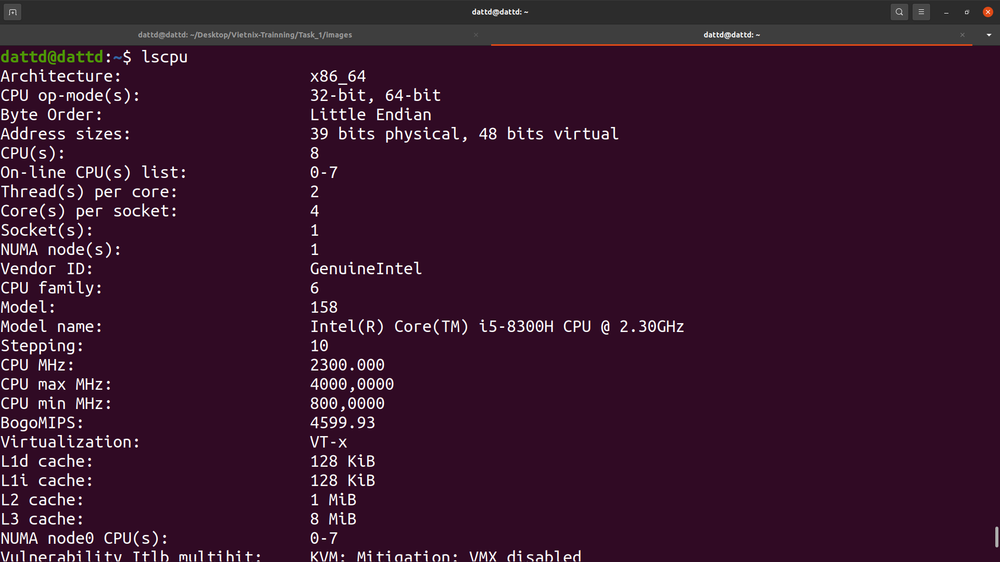
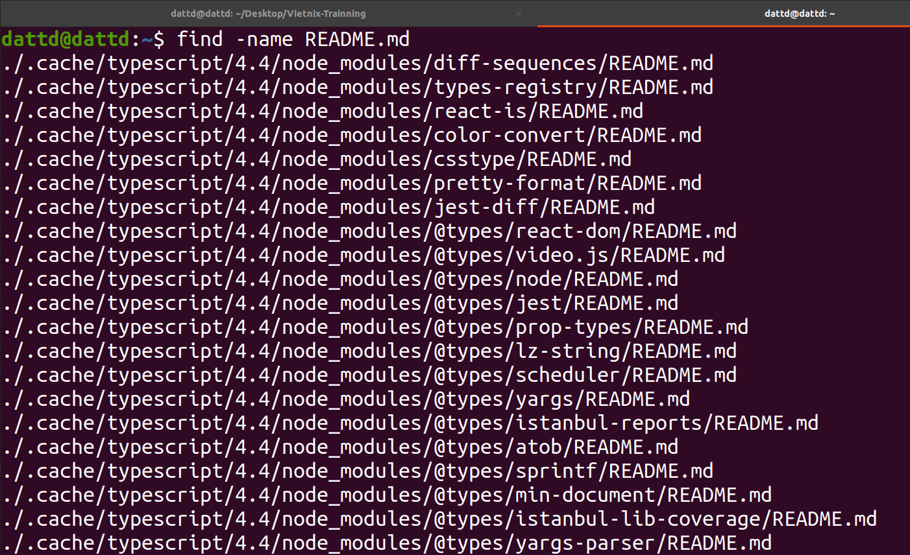
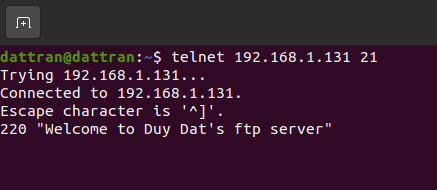

# Trainning Vietnix first task    

##    1. Xem dung lượng đĩa:  
###     1.1 df -ha  
  

##    2.  Xem các phân vùng trong hệ thống:  
###     2.1 fdisk -l  
  

###     2.2 lsblk  
  

##    3.  Xem cpu, ram, network:  
###     3.1 CPU:  
            
    
  * - Xem thông tin của CPU: cat file /proc/cpuinfo  
   
            

  * - Xem kiến trúc của CPU: lscpu  
  
###     3.2 RAM: sẽ sử dụng lệnh free kèm theo các tham số 
  * - Tham số -h sẽ cho ra kết quả dễ xem: free -h  
  

###     3.3 Network: sử dụng lệnh netstat để xem các kết nối mạng (có thể xem các kết nối tcp hoặc udp tùy theo tham số)  

  * - netstat -lp: Xem tất cả các port đang lắng nghe hoặc kết nối (bao gồm tcp và udp), có thể xem được PID của từng process thuận tiện cho việc monitor  
  

##  4. Theo dõi chi tiết các tiến trình  
- top: được sử dụng để theo dõi các tiến trình đang chạy(thời gian chạy, tổng số tiến trình đang chạy, tài nguyên được sử dụng, vd: RAM, CPU, Swap, lệnh để chạy, PID, ....)    
  

- Các thông tin liên quan đến CPU:  

- Các thông tin lien quan đến RAM:  
  
- Các thông tin liên quan đến phân vùng swap(phân vùng được sử dụng RAM hết)  
  
- Ngoài ra có thể sử dụng htop (cho phép hiển thị trực quan hơn, có thể thao tác bằng chuột, việc kill 1 process có thể được thực hiện dễ dàng mà không cần biết PID):  
  

-  kill: có thể sử dụng để tắt 1 tiến trình cụ thể, vd: kill -9 [PID] sẽ force kill tiến trình có PID cụ thể  
## 5. Liệt kê danh sách file, thư mục
- ls: Được sử dụng để liệt kê các file hoăc folder cụ thể, lệnh này cũng có thể được sử dụng kèm theo các tham số để xem được nhiều thông tin như: các permission, người sở hữu, ngày tạo file, ...  
  

-tree: có thể được sử dụng đê liệt kê các file và thư mục theo dạng cây  

## 6. Tìm kiếm, copy, di chuyển,... file/thư mục
###     6.1 Tìm kiếm file/thư mục:  
- find:  có thể tìm kiêms theo tên tuyệt đối hoặc tương đối  
- Tìm kiếm tuyệt đối: find -name [filename]  
  
- Tìm kiếm tương đối:  find -name filename* (tìm trong hệ thông tất cả các file bắt đầu bằng filname)   
  

###     6.2 Copy file hoăc folder: cp  
- cp [file_path] [copy_to_path]  

###     6.3 Di chuyển file hoặc folder: mv  
  * mv [old_path] [new_path]  
  
- Lưu ý: lệnh mv cũng có thể dung để đổi tên 1 file hoặc 1 folder  
## 7. Phân quyền  
- Sử dụng lệnh chmod kèm theo các tham số để thực hiện phân quyền  
- Các quyền về file trong Linux:  
        + x: quyền thực thi(đối với các file runable)  
        + r: quyền đọc file  
        + w: quyền ghi/ sửa đổi file  
- Ngoài các quyền được ký hiệu bằng chũ như x,w,r thì Linux cũng đinh nghĩa các quyền của 1 file theo những số:  
        + 1:  thực thi  
        + 2:  ghi  
        + 4:  đọc  
        + 7 = 4 + 2 + 1: tất cả mọi quyền  
- Các quyền về người dùng: Linux phân chia người dùng thành 3 nhóm và ta có thể thay đổi quyền quyền thực của file theo từng nhóm:  
        + user  
        + group  
        + other  
- Sử dụng lệnh chown đẻ thay đổi quyền sở hữu file của user: chown [new_owner] [filename]  
- Sử dụng lệnh chrgrp đẻ thay đổi quyền sở hữu file của group: chown [new_group_owner] [filename]  

## 8. Các trình editor: vim, vi, gedit...   
###     8.1 Vi  
- Để sử dụng trình soạn thảo vi ta dùng lênh: vi [filename]  
- Sau khi vào trình soạn thảo, vi cung cấp cho chúng ta các chế độ:   
        + command: chỉ có thể đọc  
        + insert:  chỉnh sửa văn bản
        + quit: thoát khỏi trình soạn thảo  
        + save: lưu lại nếu có sự thay đổi  
- Khi mới mở vi lên thì mặc định sẽ ở chế độ command, để có thể sửa đỏi văn bản ta phải chuyển sang chế độ insert bằng cách ấn phím i  
- Khi ở chế độ insert ta có thể chỉnh sửa văn bản
- Ta bấm esc sau đó :q để thoát khỏi vi  
- Nếu có bất kì sự thay đổi nào thì vi sẽ không cho chúng ta thoát bằng :q, chúng ta có thể thoát mà không lưu lại băng :q! hoặc lưu xong thoát bằng :wq  
  

- Ngoài chỉnh sủa tài liệu ở mức cơ bản, vi cũng cung cấp cho chúng ta nhiều tiện ích như copy(yy), dán(P), chèn dòng mới(o), xóa 1 dòng (cc), ...  
###        8.2 Gedit  
- Dễ sử dụng hơn vi bởi vì co giao diện đồ họa như notepad tên window  
- Để mở 1 văn bản bằng egdit ta sử dụng lệnh: gedit [file_name]  
- Những tao tác như copy, xóa, dán, tìm kiếm cũng dễ dàng thực hiện hơn so với việc sử dụng vi  
- Để sử dụng trình soạn thảo vi ta dùng lênh: vi [filename]  
  

## 9. Mount/ Unmount
###     9.1 Mount: 
- Lệnh mount được sử dụng kết nối các ổ dĩa vật lý vào file system của linux  
- Trước khi mount 1 ổ đĩa ta dùng lẹnh lsblk đẻ kiểm tra linux có nhậ được ổ cứng hay chưa  
  
- Linux đã nhận được hai 2 cứng (sda và sdb), ta sẽ thực hiện mount ổ sdb vào file system của linux  
- Cú pháp của lệnh mount: mount [device file] [mount point]  
  
  
- Khi mount thành công nhưng khởi động xong sẽ bị mất vì vậy ta thực hiện ghi vao file /etc/fstab để khi khởi động lại máy vẫn còn  
###     9.2 Umount:
- Ngược với mount để liê kết, umount để hủy bỏ liên kết từ Linux filesystem đến ổ cứng vật lý  
- Cú pháp: umount [device file]  
## 10. Symbolic Links  
- Symbolic links là một file đặc biệt trỏ đến một file hoặc thư mục khác - được gọi là target. Khi được tạo, một symbolic links có thể được sử dụng thay cho target file. Nó có thể có một tên độc nhất, và được đặt trong bất kỳ thư mục nào. Nhiều symbolic links thậm chí có thể được tạo cho cùng một target file, cho phép truy cập target bằng nhiều tên khác nhau.  
- Cú pháp: ln -s SOURCE_FILE SYMBOLIC_LINK 
## 11. Hard links  
- Hard links là các liên kết cấp thấp ( low-level links) mà hệ thống sử dụng để tạo các thành phần của chính hệ thống file, chẳng hạn như file và thư mục. Hard links sẽ tạo một liên kết trong cùng hệ thống tập tin với 2 inode entry tương ứng trỏ đến cùng một nội dung vật lý  
- Cú pháp: ln SOURCE_FILE SYMBOLIC_LINK  
## 12. Nén/ Giải nén  
- Nén và giải nén trên linux có thể sư dụng 2 công cụ chính là zip hoặc tar (tùy thuộc theo định dạng nén)  
###     12.1 Gzip  
             + Nén: gzip [filename.zpi]  
             + Giải nén: gzip -d [filename.zip]  
###     12.2 Tar
              + Nén: tar -cvzf  
              + Giải nén: tar -xvzf  
## 13. Đo lương băng thông sử dụng:  
  * bmon:   
  
  * vnstat:  
  * Vào file /etc/vnstat.conf để cấu hình card mạng trước khi sử dụng  
  
  
## 14. nmap, telnet, ping, ssh, transfer files from local to public host (máy ảo thay thế có ip local: 192.168.1.131)  
### 14.1    nmap: nmap là công dụng dùng để scan các remote host để thu thập được các thông tin như: port đang lắng nghe, phiên bản OS, phần mềm, .....  
-   Cú pháp chung: nmap [option] [target IP]  
-   Các option hay đươc sư dụng trên nmap:  
            + sA: TCP Ack Scan để scan các chế độ của firewall (statefull hay stateless), filter những port nào, ...  
  
            + A: scan agressive => dễ bị phát hiện  
  
            + sP: scan những server nào đang hoạt động  
  
            + sV: scan các phien bản của những phần mềm được sử dụng ở máy target  
  

### 14.2    telnet: là implementation của giao thức telnet, dùng để kết nối remote vào máy khác  
- Cú pháp: telnet [IP's target] [port's target]  
  

### 14.3     ssh: là implementation của giao thức ssh và là phiên bản nâng cấp của telnet dùng để kết nối remote đến máy khác một cách bảo mật  
- Cú pháp: ssh usename@ip_target  
  

### 14.4 ping: dựa tren trên giao thức ICMP để kiếm tra kết nôi giữa 2 thiết bị đầu cuối  
- Cú pháp: ping [ip's target]  
   

### 14.5 scp: dựa trên giao thức ssh để implement việc truyền file giữa 2 máy tính 1 cách an toàn   
- Cú pháp: scp [option] [source] username@ip_target:destinaion    
   

### 14.5 Generate SSH Key:   
- ssh-keygen: là công cụ để sinh ra 1 cặp key cho SSH  
- Cú pháp: ssh-keygen để tạp cặp publi-priate key trên máy client  
  
- Gửi public key cho server:   
- Cú pháp: ssh-copy-id -i [file key public] user@ip-address  
  
- Kết nối ssh sử dụng ssh-keygen:  

