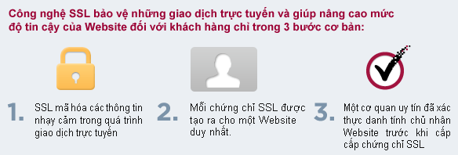

# Vietnix-trainning Report task 2  

## 1. Tìm hiểu về SSL và các vấn đề liên quan  
###     1.1 SSL là gì ??  
- SSL là viết tắt của từ Secure Sockets Layer. SSL là tiêu chuẩn của công nghệ bảo mật, truyền thông mã hoá giữa máy chủ Web server và trình duyệt. Tiêu chuẩn này hoạt động và đảm bảo rằng các dữ liệu truyền tải giữa máy chủ và trình duyệt của người dùng đều riêng tư và toàn vẹn   
- Chứng thư số SSL cài trên website của doanh nghiệp cho phép khách hàng khi truy cập có thể xác minh được tính xác thực, tin cậy của website, đảm bảo mọi dữ liệu, thông tin trao đổi giữa website và khách hàng được mã hóa, tránh nguy cơ bị can thiệp  

  
###     1.2 Một số định nghĩa, thuật ngữ hay gặp về SSL  

####        - CA (Certificate Authority)  
- CA là tổ chức phát hành các chứng thực các loại chứng thư số cho người dùng, doanh nghiệp, máy chủ (server), mã code, phần mềm. Nhà cung cấp chứng thực số đóng vai trò là bên thứ ba (được cả hai bên tin tưởng) để hỗ trợ cho quá trình trao đổi thông tin an toàn  
  

####        - DV SSL (Domain Validation)  
- Chứng thư số SSL chứng thực cho Domain Name – Website. Khi 1 Website sử dụng DV SSL thì sẽ được xác thực tên domain, website đã được mã hoá an toàn khi trao đổi dữ liệu  
  

####        - OV SSL (Organization Validation)  
- Chứng thư số SSL chứng thực cho Website và xác thực doanh nghiệp đang sở hữu website đó  

  

####        - EV SSL (Extended Validation)
- Cho khách hàng thấy Website đang sử dụng chứng thư SSL có độ bảo mật cao nhất và được rà soát pháp lý kỹ càng.  

  

####        - SANs SSL (Subject Alternative Names)  
- Nhiều tên miền hợp nhất trong 1 chứng thư số.  
- Một chứng thư số SSL tiêu chuẩn chỉ bảo mật cho duy nhất một tên miền đã được kiểm định. Lựa chọn thêm SANs chỉ với chứng thư duy nhất bảo đảm cho nhiều tên miền con.   
####        - Wildcard SSL (Wildcard SSL Certificate)  
- Sản phẩm lý tưởng dành cho các cổng thương mại điện tử. Mỗi e-store là một sub-domain và được chia sẻ trên một hoặc nhiều địa chỉ IP. Khi đó, để triển khai giải pháp bảo bảo mật giao dịch trực tuyến (đặt hàng, thanh toán, đăng ký & đăng nhập tài khoản,…) bằng SSL, chúng ta có thể dùng duy nhất một chứng chỉ số Wildcard cho tên miền chính của website và tất cả sub-domain.  
  

###     1.3 Tại sao nên sử dụng SSL ?
- Khi đăng ký tên miền để sử dụng các dịch vụ website, email v.v… luôn có những lỗ hổng bảo mật cho hacker tấn công, SSL bảo vệ website và khách hàng: 
    - An toàn dữ liệu: dữ liệu không bị thay đổi bởi hacker  
    - Bảo mật dữ liệu: dữ liệu được mã hóa và chỉ người nhận đích thực mới có thể giải mã  
    - Chống chối bỏ: đối tượng thực hiện gửi dữ liệu không thể phủ nhận dữ liệu của mình  
- Tiêu chuẩn xác thực – SSL chỉ được cung cấp bởi các đơn vị cấp phát chứng thư (CA) có uy tín trên toàn thế giới sau khi đã thực hiện xác minh thông tin về chủ thể đăng ký rất kỹ càng mang lại mức độ tin cậy cao cho người dùng Internet.  

  

## 2. Domain   

###     2.1 Domain là gì ?
            - Domain (tên miền) là địa chỉ website hoạt động trên Internet. Là cách nhận diện một website được sử dụng thay thế cho địa chỉ IP dài và khó nhớ.  
              
            - Khi nhập một tên miền (domain name) vào trình duyệt web, trước tiên nó sẽ gửi một request đến mạng global gồm các máy chủ DNS. Sau đó, các máy chủ này sẽ tìm kiếm các nameserver được liên kết với domain và chuyển tiếp request đến các nameserver đó.  
            - Các nameserver này là do Công ty Hosting quản lý. Công ty cung cấp dịch vụ Hosting sẽ trả về địa chỉ IP máy chủ chứa website.   
  

###     2.2 Các loại domain   
####        - Top-level domain (TLD)  
-TLD là viết tắt của “top-level domain” – tên miền cấp cao nhất là phần cuối cùng sau dấu chấm của một tên miền và là phần mở rộng domain được liệt kê ở cấp cao nhất trong DNS.   
####        - Country-code top-level domain (ccTLD)
- Là các domain được sử dụng ở một quốc gia cụ thể theo mã ISO (Tổ chức tiêu chuẩn hóa quốc tế) như .vn cho Việt Nam, .uk cho Anh, .es cho Mỹ (United States), .es cho Tây Ban Nha,… được sử dụng bởi các website muốn nhắm mục tiêu đến người dùng ở một quốc gia cụ thể. Và cho thấy người dùng truy cập đúng địa chỉ trang web của một quốc gia   
####        - Generic top-level domain (gTLD)
- Là tên miền được sử dụng phổ biến và được dùng trên toàn thế giới mà không phụ thuộc vào mã quốc gia nào   
####        - Sponsored top-level domain (sTLD)
- Là các tên miền cấp cao bị giới hạn như ở trên đã đề cập như .gov, .mil. Ngoài ra, còn có .edu (cho tổ chức giáo dục), .asia (cho các công ty thị trường Châu Á), .post (cho bưu chính), .coop, .museum,…  
####        - Infrastructure top-level domain (iTLD) 
- Là tên miền .arpa đại diện cho ARPA và dành riêng cho ICANN để giải quyết các vấn đề về cơ sở hạ tầng.  

##  3. DNS

###     3.1 DNS là gì ?
- DNS là hệ thống phân giải tên miền. Hiểu một cách ngắn gọn nhất, DNS cơ bản là một hệ thống chuyển đổi các tên miền website mà chúng ta đang sử dụng, ở dạng www.tenmien.com sang một địa chỉ IP dạng số tương ứng với tên miền đó và ngược lại.  
  

###     3.2 Một số record của DNS  
  

##  4. Hosting, vps, server  

###     4.1 Hosting  
- Hosting (hay web hosting) là một dịch vụ online xuất bản website hoặc ứng dụng web lên Internet. Khi  đăng ký dịch vụ hosting, tức là thuê mộ chỗ đặt trên server chứa tất cả các files và dữ liệu cần thiết để website chạy được.   

###     4.2 Server   
- Một server là một máy tính vật lý chạy không gián đoạn để website có thể luôn hoạt động mọi lúc cho tất cả mọi người truy cập vào. Nhà cung cấp Web Hosting chịu trách nhiệm cho việc giữ server hoạt động, chống tấn công bởi mã độc, và chuyển nội dung (văn bản, hình ảnh, files) từ server xuống trình duyệt người dùng.  
  

###     4.3 VPS  
- VPS là viết tắt của Virtual Private Server (máy chủ riêng ảo). Một VPS cũng giống như shared host, tức là có nhiều VPS được đặt trên cùng một máy chủ vật lý.  
  

##  5. Reverse proxy

###     5.1 Reverse proxy là gì ?
- Proxy server là một máy chủ trung gian hoặc trung gian chuyển tiếp các yêu cầu nội dung từ nhiều máy khách đến các máy chủ khác nhau trên Internet, hường nằm sau tưởng lửa trong một mạng riêng và điều hướng các yêu cầu của client đến máy chủ thích hợp.  
- Các reverse proxy thường được triển khai để giúp tăng cường bảo mật, hiện suất và độ tin cậy.  
  

###     5.2 Nguyên lý hoạt động  
- Bước 1: Request của người dùng được gửi đến Reverse proxy  
- Bước 2: Reverse proxy sẽ chuyển tiếp request của người dùng đến web server  
- Bước 3: Web server nhận được request sau đó xử lý và trả về response cho Reverse proxy  
- Bước 4: Reverse proxy gửi reponse cho người dùng đồng thời lưu lại response này vào bộ nhớ cache 
- Bước 5: Lần tiếp theo người dùng gửi request giống như lần trước thì Reverse proxy sẽ vào bộ nhớ cache để tìm và trả lại response chứ không thông qua web server để đảm bảo đc performace  

  

##  6. So sánh giữa Apache và Enginx  
###     6.1 Apache  

  

#### Hiệu năng  
- Web tĩnh: Nginx nhanh hơn 2,5 lần Apache dựa trên một thử nghiệm kiểm chuẩn chạy tới 1000 kết nối đồng thời.  
- Web động: tương tự  
#### Hệ điều hành hỗ trợ  
- Apache hoạt đọng trên tất các các hệ thông unix-base và hỗ trợ đầy đủ cho Microsoft Windows.  
- Nginx cũng hỗ trợ Window nhưng hiệu xuất không mạnh bằng  
#### Bảo mật  
- 2 web server có khả năng bảo mật ngang nhau (tùy theo cách cấu và lựa chọn các module thêm)  
#### Tài liệu  
- Tài liệu của cả 2 cũng rất đẩy đủ  
- Nginx nhỉnh hơn vì cung cấp các khóa đào tạo trực tuyến, thậm chí họ còn tổ chức thi chứng chỉ    
#### Sự hỗ trợ
- 2 bên đều cung cấp những module bên thứ 3 (có trả phí) để hỗ trợ bổ sung một số tính năng nâng cao  

