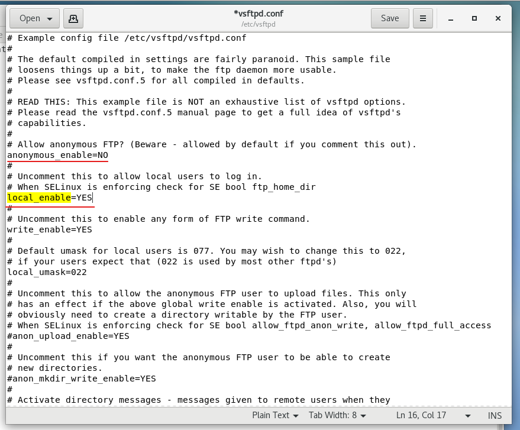

# Vietnix-trainning Report task 4  
  

## 1. Reverse proxy (nginx)    
- Reverse Proxy được hiểu là một proxy server trung gian giữa Client (máy khách) và Server (máy chủ). Mội yêu cầu (request) từ client tới máy chủ và ngược lại phản hồi (reponse) từ máy chủ về client đều bắt buộc phải đi qua proxy server.  
- Máy chủ hoàn toàn được ẩn danh trước Client. Các client chỉ có thể biết được thông tin của Proxy Server  
- Mô hình:  
  

- Trước khi có reverse proxy:  
  

- Sau khi có reverse proxy sử dụng nginx:  
  

- Các bước thực hiện: 
    - Vì sử dụng chung web server (apache) và reverse proxy (nginx) trên cùng 1 máy chủ vật lý và cả 2 port mặc định của 2 service này đều là 80 nên ta sẽ tiến hành đổi port của web server (apache) thành 8888 để tránh trùng port  
    - Sử dụng gedit vào file cấu hình của apache theo đường dẫn: /etc/httpd/httpd.conf sửa port listen thành 8888   
    
  

    

  * - Sau khi đổi port trên apache thì ta sẽ restart lại dịch apache:  systemctl restart httpd  
    
  

    

  * - Cài nginx sử dụng lệnh: sudo yum install nginx -y  
    
   

  *     - Cấu hình reverse proxy cho nginx:  
    - Khi những request truy cập đến http://localhost:8888 (apache web server) thì nginx sẽ thực hiện redirect sang domain dattran.info  
    - Ngoài ra chúng ta có thể thực hiện cấu hình thêm nhiều tính năng khác như: cache response của web server, load balancing, ....  
    
   

##  2. Remote database (MySql)  

- Trong những kiến trúc phần mềm hiện đại, database và phần back-end có thể được tách riêng ra những server vật lý khác nhau, vì vậy chúng ta cần tạo một kết nối từ xa để có thể truy cập được database(trường hợp này là MySql)  

   
- Kiểm tra đường dẫn đến file cấu hình của mysql:  mysql --help | grep "Default option" -A 1  

   
    
- Sử dụng gedit để sửa file cấu hình: gedit /etc/my.cnf  
- Thêm dòng bind-address=192.168.1.131 (IP của server để remote MySql)  

   

- Kết nối đến Remote MySql: mysql -u dattran -h 192.168.1.131 -p  

   

## 3. Cài Vsftpd  

- Cài đặt vsftpd trêm centOS 7: yum install vsftpd   
   

- Start và enable dịch vụ vsftpd trên centOS 7:  
    - systemctl start vsftpd  
    - systemctl enable vsftpd  
    
   

- Cấu hình dịch vụ vsftpd ở đường dẫn: /etc/vsftpd/vsftpd.conf   

     

     

     

    

- Lưu file cấu hình và restart lại dịch vụ vsftpd:   

    

- Kiểm tra dịch vụ ftp từ 1 máy khác:  ftp 192.168.1.131 (IP của server sử dụng dịch vụ vsftpd)  

    

## 4. Mở 1 số port  
- Sử dụng tường lửa mặc định của centOS 7 là firewalld để mở 1 port : 80, 443, 3306, 22  

    

## 5. Cài phpmyadmin  

- Dùng repo mặc định của centOS, cài phpmyadmin bằng lệnh: yum install phpmyadmin  
- Sau khi cài thành công ta restart lại httpd (apache) sử dụng lệnh: systemctl restart apache  

    

- Mở trình duyệt theo đường dẫn: http://localhost/phpmyadmin ta sẽ thấy được trang đăng nhập của phpmyadmin, mặc định ta có thể sử dụng tài khoản root để đăng nhập  

    

- Đăng nhập thành công  

    

## 6. Cài Wordpress   

- Tải mã nguồn của wordpress sử dụng lệnh wget: wget http://wordpress.org/latest.tar.gz  
- Giải nén sử dụng lệnh: tar -xzvf latest.tar.gz  
- Chuyển code của wordpress sang thư mục của apache: sudo mv /wordpress/* /var/www/html  
- Restart lại dịch vụ apache  
- Sử dụng trình duyệt vào http://localhost/ chọn ngôn ngữ  
- Nhập các thông tin như tên website, user và password của admin:  

    

- Trang của admin:  

    

- Trang chính:  

    

## 7. Cài Laravel  

- Thêm các repo cần thiết để cài đặt Laravel:  
    - rpm -Uvh https://dl.fedoraproject.org/pub/epel/7/x86_64/Packages/e/epel-release-7-12.noarch.rpm  
    - rpm -Uvh http://rpms.famillecollet.com/enterprise/remi-release-7.rpm  
- Cài composer : 
    - curl -sS https://getcomposer.org/installer | php  
    - mv composer.phar /usr/bin/composer  
    - chmod +x /usr/bin/composer  

    

- Cài Laravel:  
    - cd /var/www/  
    - git clone https://github.com/laravel/laravel.git  

    

- Sinh ra key mã hóa:  
    - php artisan key:generate  

    

- Cấu hình virtual host:  
    - Sử dụng gedit để thêm file cấu hình cho laravel: gedit /etc/httpd/conf.d/lavarel.conf  

    

- Sủ dụng trình duyệt vào: http://dattran.com:8080/   
  
