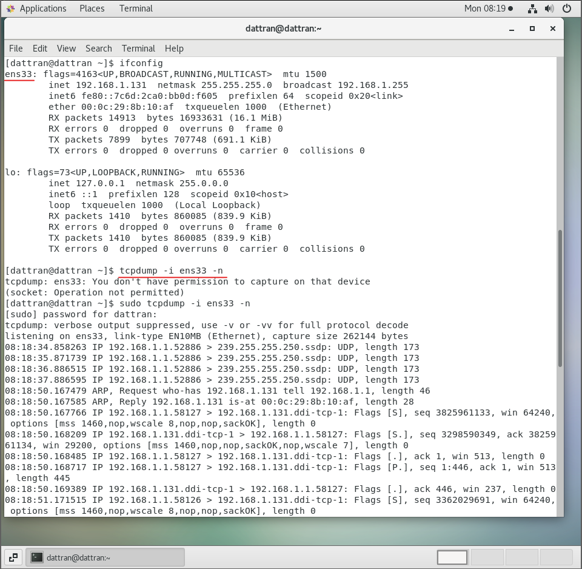
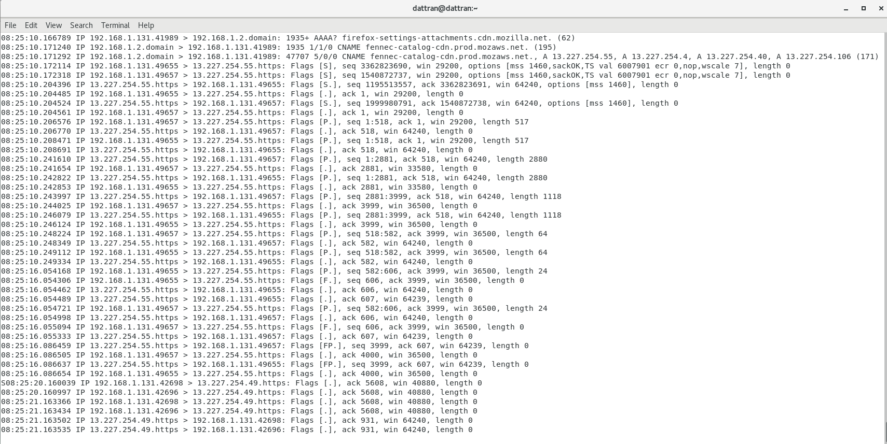
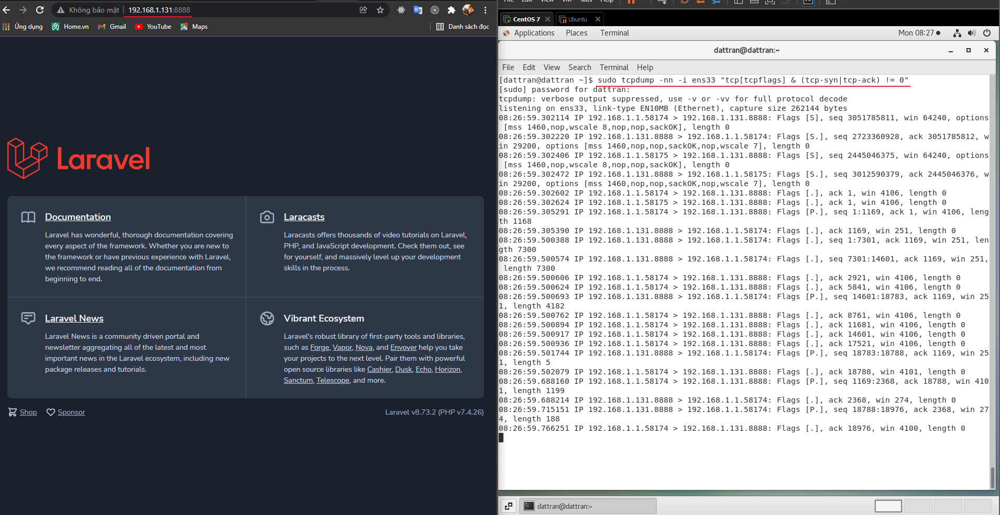
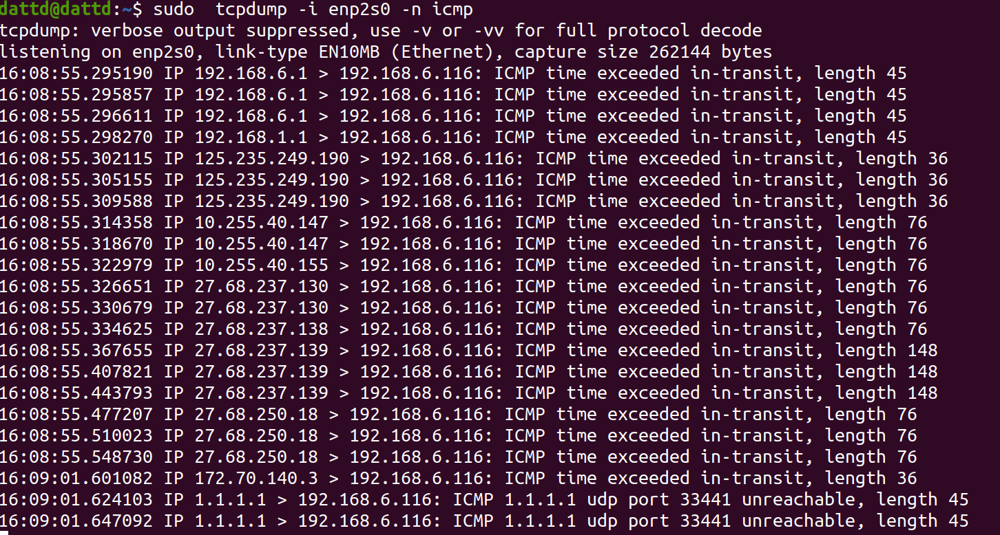
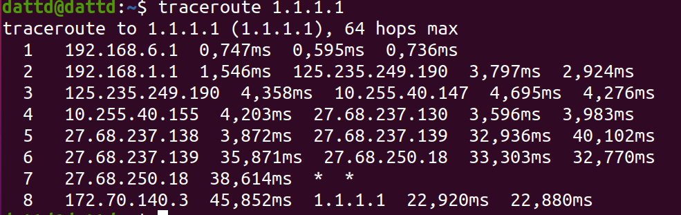

# Report task 5  

## 1. iptables  

###  1.1 Mô hình iptabales:  
- IPtables là ứng dụng tường lửa miễn phí trong Linux, cho phép thiết lập các quy tắc riêng để kiểm soát truy cập, tăng tính bảo mật   
- Sơ đồ mô tả luồng hoạt động của iptables:  

  

###  1.2 Các chain trong iptables: Chains được tạo ra với một số lượng nhất định ứng với mỗi Table, giúp lọc gói tin tại các điểm khác nhau  

- PREROUTING: thay đổi địa chỉ đến của gói dữ liệu khi cần thiết (có trong các table: nat, mangle, raw)   
- INPUT: lọc các gói tin khi đi vào trong server (có trong các table: nat, mangle)  
- OUTPUT: lọc các gói tin khi đi ra trong server (có trong các table: mangle, raw, filter)   
- FORWARD: lọc các gói tin khi đi đến các server khác server (có trong các table: mangle, filter)  
- POSTROUTING: thay đổi địa chỉ nguồn của gói dữ liệu khi cần thiết (có trong các table: nat, mangle)      
###  1.3 Các tables trong iptables: Table được IPtables sử dụng để định nghĩa các rules dành cho các gói tin. Trong đó, có các Table sau:    

- Filter Table: Là một trong những tables được IPtables sử dụng nhiều nhất, Filter Table sẽ quyết định việc một gói tin có được đi đến đích dự kiến hay từ chối yêu cầu của gói tin  
- NAT Table: có trách nhiệm chỉnh sửa IP nguồn hoặc IP đích của gói tin khi thực hiện cơ chế NAT   
- Mangle Table: Cho phép chỉnh sửa header của gói tin, giá trị của các trường TTL, MTU, Type of Service  
- Raw Table: làm việc với các gói tin trước khi kernel bắt đầu kiểm tra trạng thái và có thể loại một số gói khỏi việc tracking vì vấn đề performance của hệ thống  
- Security Table:  Một vài kernel có thể hỗ trợ thêm Security Table, được dùng bởi SELinux để thiết lập các chính sách bảo mật   

###   1.4 Target và Jumps   
- Jump là cơ chế chuyển một packet đến một target nào đó để xử lý thêm một số thao tác khác   
-  Target là cơ chế hoạt động trong iptables, dùng để nhận diện và kiểm tra packet. Các target được xây dựng sẵn trong iptables như:  
    - ACCEPT: iptables chấp nhận chuyển data đến đích  
    - DROP: iptables khóa những packet  
    - REJECT: ngăn chặn packet và gởi thông báo cho sender  
    - DNAT: thay đổi địa chỉ đích của packet  
    - SNAT: thay đổi địa chỉ nguồn của packet  
    - MASQUERADING: được sử dụng để thực hiện kỹ thuật NAT (giả mạo địa chỉ nguồn
với địa chỉ của interface của firewall)  
    - LOG: thông tin của packet sẽ gởi vào syslog daemon iptables tiếp tục xử lý rule tiếp
theo trong table luật. Nếu rule cuối cùng không match thì sẽ drop packet  

###   1.5 Đường đi của các gói tin trong các kịch bản:    

**- Gói tin có destination là IP server: ** các packet từ internet khi đi vào  sẽ qua các chain PREROUTING (mangle và nat), các chain này giúp sửa đổi gói tin (có thể có hoặc không) và NAT các IP từ public internet vào mạng nội bộ. Sau đó qua chain INPUT và dựa vào rule được định nghĩa bởi iptables để quyết định (filter) sẽ nhận hay drop các gói tin này, nếu gói tin được cho phép đi qua thì server xử lý các gói tin nhận được   

Packet from Network -> PREROUTING/nat -> PREROUTING/nat -> Routing decision -> INPUT/filter -> Local data process.  

**- Gói tin từ server đi ra:**  dữ liệu khi được server xử lý sẽ tiếp tục dựa trên routing decision để xem dữ liệu sẽ được gửi ra internet hay được tiếp tục forward qua 1 mạng khác để xử lý. Nếu được gửi đi public internet thì các gói tin tiếp tục phải qua chain OUTPUT/mangle để chỉnh sửa gói tin (có thể có hoặc không), sau đó đến chain OUTPUT/nat để NAT các ip local thành các ip public. Sau đó tiếp tục được filter và sang các chain POSTROUTING (mangle và nat) cuối cùng thì các gói tin ra internet   
  
Local process -> Routing decision -> OUTPUT/mangle -> OUTPUT/nat -> OUTPUT/filter -> POSTROUTING/mangle -> POSTROUTING/nat -> Internet   

**- Gói tin có destination là IP không phải của server:**  khi decision routing quyết định rằng các gói tin đến server nhưng không phải của server thì iptables sử dụng chain FORWARD(mangle và filter) để chuyển tiếp các gói tin đến các chain POSTROUTING(mangle và nat) sau đó chuyển các gói tin này đến một mạng khác.   

Routing dec ision -> FORWARD/mangle -> FORWARD/filter -> POSTROUTING/mangle -> POSTROUTING/nat -> Othe network  

## 2. Sử dụng module trace để theo dõi các gói tin   
###     2.1 Theo dõi gói SYN từ IP máy client đến máy ảo host web:  
- Sử dụng tcpdump để theo dõi lưu lượng mạng đi ra và vào từ máy ảo centOS:  
    - tcpdump -i ens33 -n:  
    - 
  

- Sử dụng 1 máy client để truy cập dịch vụ web đang được host trên máy centOS để thấy rõ được quy trình kết nối của giao thức HTTP (dựa trên TCP)  

  

- Kết quả:   

   

- Những gói tin có kí hiệu Flag [S] có nghĩa là cờ SYN trong quá trình bắt tay, server phản hổi với những gói tin có kí hiệu Flag[S.] cõ nghĩa là những gói SYN-ACK. Những gói tin có kí hiệu Flag [.] là gói ACK  
- Có thể sử dụng lệnh sau để theo dõi quá trình bắt tay TCP:   
tcpdump -nn -i ens33 "tcp[tcpflags] & (tcp-syn|tcp-ack) != 0" để theo dõi quá trình bắt tay TCP    

   

###         2.2 Theo dõi gói icmp ping đi 1.1.1.1 đi   

- tcpdump -i enp2s0 -n icmp  

  

- Cũng có thể sử dụng lệnh traceroute để theo dõi các hop mạng trước khi đến với ip đích cuối cùng 1.1.1.1: traceroute 1.1.1.1   

  

## 3. Đọc hiểu 1 số rules căn bản của iptables  

- Cho phép khởi tạo kết nối HTTP, HTTPS ở card mạng eth0:   
    - iptables -A OUTPUT -o eth0 -p tcp -m multiports --dports 80,443 -m state --state NEW, ESTABLISHED -j ACCEPT   
    - iptables -A OUTPUT -o eth0 -p tcp -m multiports --dports 80,443 -m state --state NEW, ESTABLISHED -j ACCEPT   

- Cho phép SSH Input vào điều khiển ở card mạng eth0:  
    - iptables -A INPUT -i eth0 -p tcp --dport 22 -m state --state NEW,ESTABLISHED -j ACCEPT  
    - iptables -A OUTPUT -o eth0 -p tcp --sport 22 -m state --state ESTABLISHED -j ACCEPT

- Cho phéo truy xuất DNS đến firewall ở card mạng eth0:   
    - iptables -A OUTPUT -p udp -o eth0 --dport 53 –sport 1024:65535 -j ACCEPT      
    - iptables -A INPUT -p udp -i eth0 --dport 53 –sport 1024:65535 -j ACCEPT       
    
- Cho phép IP X truy cập đến IP dest A.B.C.D port YYY:    
    - iptables -A INPUT -s X -d A.B.C.D --dport YYY -j ACCEPT  

- Chặn IP X truy cập đến IP dest A.B.C.D port YYY:    
    - iptables -A INPUT -s X -d A.B.C.D --dport YYY -j DROP  

- Cho phép tất cả các ip mới truy cập đến IP dest A.B.C.D port YYY   
iptables -A INPUT  -m state --state NEW --dport YYY -j ACCPET  

- Chặn tất cả các ip mới truy cập đến IP dest A.B.C.D port YYY   
    - iptables -A INPUT  -m state --state NEW --dport YYY -j DROP  

- Đặt comment cho 1 iptables rules bất kỳ:  để thêm comment cho 1 rule ta sử dụng module comment  
    - iptbales -A OUTPUT -p icmp --icmp-type echo-reply -j DROP -m comment --comment "Block ping reply to server"  
    - iptables -A INPUT -p icmp --icmp-type echo-request -j DROP -m comment --comment "Block ping request to server"  

## 4. Tìm hiểu về tcpdump và các option thường dùng   
- tcpdump là phần mềm bắt gói tin trong mạng làm việc trên hầu hết các phiên bản hệ điều hành Linux. tcpdump cho phép chúng ta bắt và lưu lại các gói tin bắt được, để chúng ta có thể sử dụng phân tích  
- Các tùy chọn thường sử dụng trong tcpdump:  
    - -n để hiển thị địa chỉ IP của các máy liên quan. Nếu không dùng tùy chọn này chỉ bắt được các gói tin chứa các địa chỉ DNS thay vì địa chỉ IP  
    - -E : Giải mã lưu lượng IPSEC bằng cách cung cấp khóa mã hóa  
    - -q : Hiển thị ít thông tin giao thức   
    - -e : Nhận tiêu đề ethernet  
    - -S : In số thứ tự tuyệt đối  
    - -c : Chỉ nhận được x số gói và sau đó dừng lại  
    - -s : Xác định snaplength(kích thước) của gói tin theo byte. Sử dụng -s0 để có được mọi thứ. Nếu không set size packet dump thành unlimit, thì khi tcpdump ra nó bị phân mảnh  
    - vv : Đầu ra cụ thể và chi tiết hơn (nhiều v hơn cho đầu ra nhiều hơn)  
    - -i : Bắt lưu lượng của một card mạng cụ thể  
    - -tttt : Cung cấp đầu ra dấu thời gian tối đa có thể đọc được của con người   
    - -t : Cung cấp đầu ra dấu thời gian có thể đọc được của con người   
    - -l : Đầu ra có thể đọc được dòng (để xem khi lưu hoặc gửi đến các lệnh khác)  
    - -D : Liệt kê các giao diện mạng có sẵn  
    - -X : Hiển thị nội dung của gói theo định dạng ASCII và HEX  
    - -XX : Tương tự -X, hiển thị giao diện ethernet  
    - -c: chỉ định số lượng gói cần bắt  
    - -w ghi các gói vào một tập tin nhất định. Phần mở rộng tệp phải là .pcap, để có thể được đọc bởi bất kỳ bộ phân tích giao thức mạng nào   
    - -r: để đọc file .pcap   
